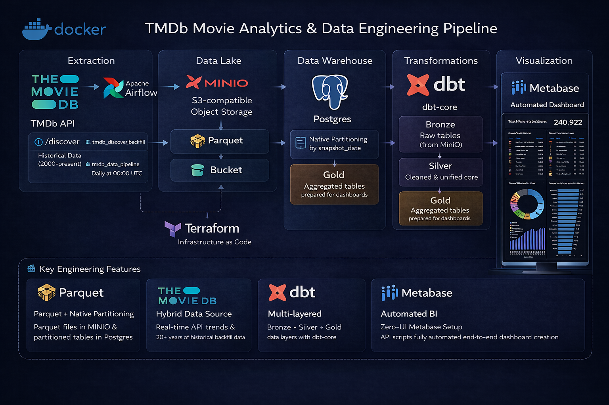
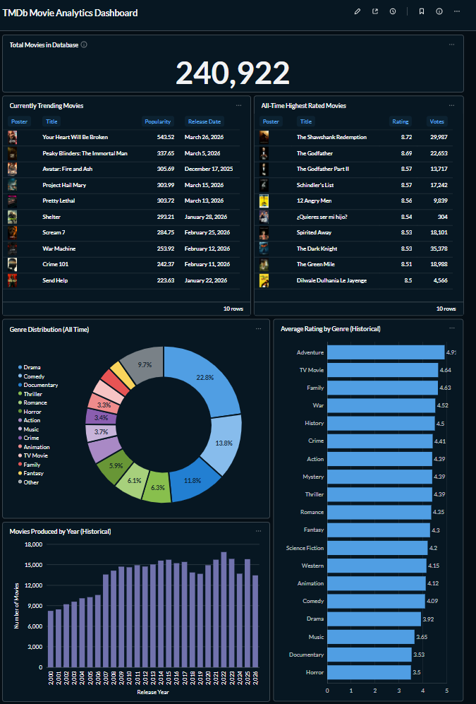

# TMDb Movie Analytics & Data Engineering Pipeline

A complete end-to-end batch data pipeline that extracts movie data from the TMDb API, stores it in a MinIO data lake as Parquet, loads it into a Postgres Data Warehouse (DWH), and transforms it using dbt into an automated Metabase dashboard.

## 📝 Problem Statement
Analyzing movie trends requires both historical data and current snapshots. However, the TMDb API standard endpoints (/popular, /trending) only provide real-time "snapshots" without any historical context. To understand long-term shifts in movie production, genre popularity, and rating trends, we need to:

1. Backfill historical data using the TMDb Discover API (years 2000–present) to capture the volume of movies released each year and their ratings.

2. Daily Snapshots collect current trends from multiple endpoints to track what is popular and highly rated right now.

3. Persist raw data in a scalable Data Lake (MinIO) to enable reprocessing and schema evolution.

4. Model clean and unify the two data sources (real-time API vs. historical backfill) into a consistent analytical layer using dbt.

5. Visualize build a comprehensive dashboard that compares historical production volume, genre distribution, and all-time ratings with current daily trends.

This project solves the “lack of history” problem by creating an automated, idempotent pipeline that produces a unified dataset ready for analytics and visualization.

## 🏗 System Architecture Overview



## 🏗 Architecture

1.  **Orchestration**: Apache Airflow (Daily Pipeline + Manual Backfill)
2.  **Infrastructure as Code**: Terraform (Automated MinIO bucket management)
3.  **Data Lake**: MinIO (S3-compatible) - Raw data stored in **Parquet** format
4.  **Data Warehouse**: Postgres - Optimized with **Native Partitioning** by `snapshot_date`
5.  **Transformations**: dbt (dbt-core) - Multi-layered modeling (Bronze -> Silver -> Gold)
6.  **Visualization**: Metabase - Fully automated setup via REST API

## ⚙️ Pipeline Type

This project uses a batch pipeline:

*   Daily scheduled ingestion (Airflow DAG)
*   Historical backfill via manual trigger

## 🚀 How to Run

1.  **Clone the repository**.
2.  **Configure Environment**:
    *   Create a `.env` file (copy from `.env.example` if available).
    *   Add your `TMDB_API_KEY` from [themoviedb.org](https://www.themoviedb.org/documentation/api).
3.  **Start Services**:
    ```bash
    docker-compose up -d
    ```
    *This starts Airflow, Postgres, MinIO, Metabase, and runs auto-configuration scripts.*

4.  **Initial Data Load (Manual Backfill)**:
    *   Access **Airflow**: [http://localhost:8080](http://localhost:8080) (login: `airflow` / `airflow`).
    *   Find and trigger the `tmdb_discover_backfill` DAG manually. This will fetch movie data from year 2000 to present.
    *   The `tmdb_data_pipeline` (daily snapshots) is automatically unpaused and will run daily .

5.  **View Dashboard**:
    *   Access **Metabase**: [http://localhost:3000](http://localhost:3000).
    *   Login: `admin@example.com` / `metabase_password123`.
    *   Open the **"TMDb Movie Analytics Dashboard"** (Collections/Our analytics)

## 🔁 Data Flow

1. Airflow triggers ingestion
2. Data pulled from TMDb API
3. Stored as Parquet in MinIO
4. Loaded into Postgres (partitioned)
5. Transformed via dbt
6. Exposed to Metabase dashboard

## 🔄 Data Layers (dbt)

Bronze
*   Raw tables

Silver
*   Cleaned & deduplicated data
*   Unified schema

Gold
*   Aggregated analytics tables

## 💎 Key Engineering Features

*   **Native Partitioning**: Postgres tables are partitioned by `snapshot_date`. New partitions are created dynamically by the ingestion script.
*   **Hybrid Data Source**: Combines real-time API results with bulk historical data.
*   **Zero-UI BI Setup**: Metabase is configured via Python scripts that use the API to create the DB connection, cards, and dashboard automatically.
*   **Schema Evolution**: Uses SQLAlchemy inspector to ensure Parquet-to-Postgres mapping remains consistent even if API fields change.

## 📊 Visualizations (Metabase)
The automated dashboard includes:
1. **Total Movies in Database** – a scalar showing the total number of movies stored in the warehouse.
2. **All-Time Highest Rated Movies** – a table of the top 10 movies by vote average (all‑time) with rendered posters.
3. **Currently Trending Movies** – a table of the top 10 movies by current popularity based on the daily snapshot.
4. **Genre Distribution (All Time)** – a pie chart displaying the percentage of movies belonging to each genre.
5. **Average Rating by Genre (Historical)** – a horizontal bar chart showing the average rating per genre using historical data (2000–present).
6. **Movies Produced by Year (Historical)** – a bar chart illustrating the number of movies released each year since 2000.



## ☁️ Cloud Scalability
Designed for seamless migration:
*   **MinIO** -> AWS S3 / GCS
*   **Postgres** -> AWS RDS / BigQuery / Snowflake
*   **Airflow** -> Managed Airflow (MWAA / Astronomer)
*   **Terraform** -> Ready to manage cloud-native resources.

## ✅ Reproducibility

The project is fully reproducible via Docker:
*   All services run locally
*   Minimal setup required
*   Automated configuration scripts included